```{r setup, include=FALSE}
knitr::opts_chunk$set(echo = TRUE)
```


# Contents & Purposes
  
This introductory lecture is related to:  

 * fundamental math concepts    
 * programming with R    
 * basic statistics  

The lecture aims at:  

 * providing the basis of R & RStudio  
 * getting an idea of what is programming with R     
 * reviewing some statistical topics  
  
&nbsp;  


# Math Essentials
  
&nbsp;  
  
<center>
{width=100%}
</center> 

&nbsp;  


## Matrices and Vectors

"A matrix is a rectangular array[1] of numbers, symbols, or expressions, 
arranged in rows and columns." 
([Wikipedia](https://en.wikipedia.org/wiki/Matrix_(mathematics)))  

&nbsp;  
  
<center>
{width=60%}
</center>  
  
&nbsp;  
  
In particular, matrices can be divided by the following common types  
  
&nbsp;  
  
<center>
{width=100%}
</center>  

&nbsp;  


## Matrix Algebra

[Matrix Algebra](https://www.khanacademy.org/math/algebra-home/alg-matrices)  
The link send to a webpage containing a detailed explanation of all matrix 
operations.

&nbsp;  


## Functions

"A function is a process or a relation that associates each element $x$ of 
a set $X$, the domain of the function, to a **single** element $y$ of another
set $Y$ (possibly the same set), the codomain of the function."
([Wikipedia](https://en.wikipedia.org/wiki/Function_(mathematics)))  
  
&nbsp;  
  
<center>
{width=50%}
</center>  
  
&nbsp;  
  
 * the element $x$ is the argument, the input or the independent variable 
 of the function;  
 * $f(.)$ is the function or the program that maps $x$ to $y$ 
 ($x \to f(.) \to y$);    
 * $y$ is the value of the function, the output, the dependent variable or 
 the image of $x$;  
  
Thus, a function describes the relation between input and output, the 
independent variable and the 
dependent variable, and the relation is denoted by $y = f(x)$.  
  
Functions can have one or more arguments or variables. The latter is generally 
defined as $y = f(x_1, x_2, ..., x_n)$, which is a generic function $f$ 
taking $n$ inputs or arguments $(x_1, x_2, ..., x_n)$ and producing a single 
output $y$.  
  
&nbsp;  
  
<center>
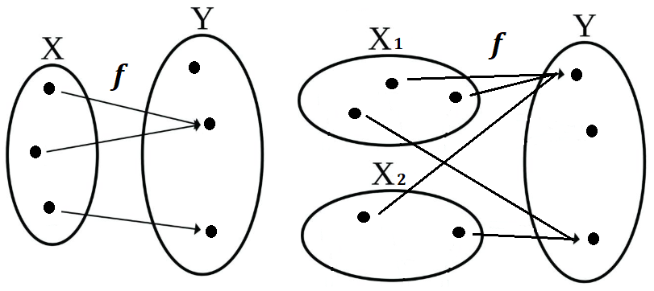
</center>  
  
&nbsp;  
  
A simple example of a function  
  
&nbsp;  
  
<center>

</center>  
  
&nbsp;  
  
An example of a common function of more than one variable for excel users:  
  
&nbsp;  
  
<center>
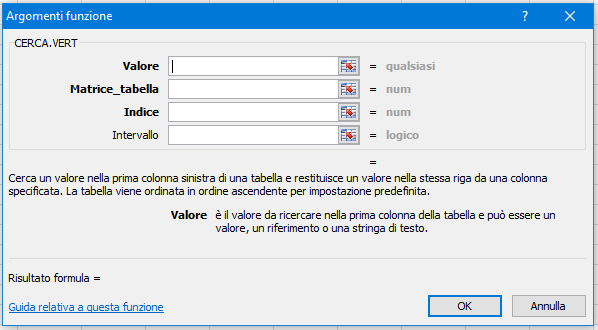
</center>  

&nbsp;  
&nbsp;  
&nbsp;  
  


# Programming

&nbsp;  
  
<center>
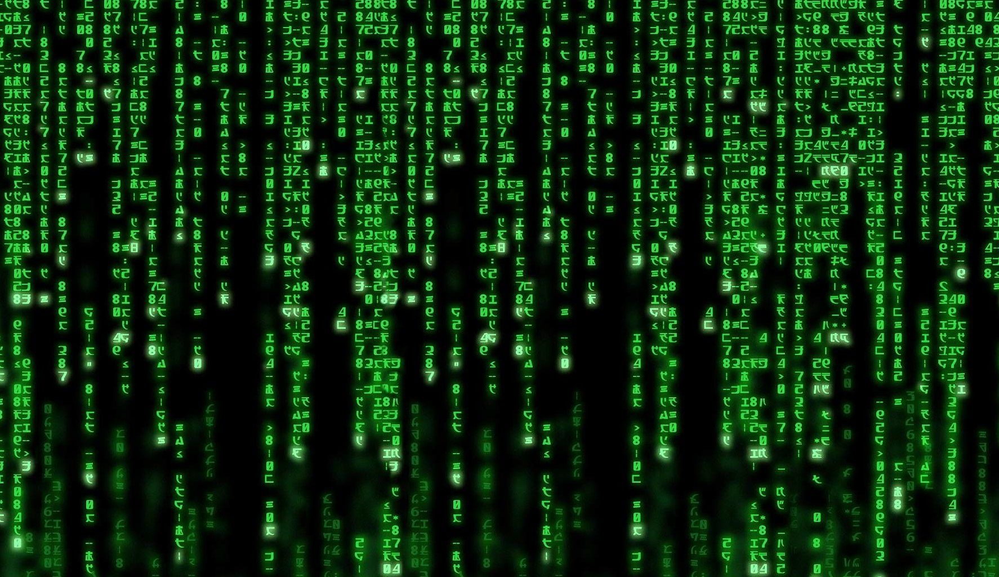
</center>

&nbsp;  

## What is a Programming Language?

A **programming language** is ...   

"a formal language, which comprises a set of instructions that produce 
various kinds of output. Programming languages are used in computer 
programming to implement algorithms." 
([Wikipedia](https://en.wikipedia.org/wiki/Programming_language))  

"a computer language engineered to create a standard form of commands. 
These commands can be interpreted into a code understood by a machine."
([Techopedia](https://www.techopedia.com/definition/24815/programming-language))  

"a computer language programmers use to develop software programs, scripts, 
or other sets of instructions for computers to execute."
([Computerhope](https://www.computerhope.com/jargon/p/programming-language.htm))  

&nbsp;  
  
<center>

</center>  
  
&nbsp;  
  
Summarizing, a programming language is:

 * a formal language  
 * a standard form of commands
 * a set of instructions to communicate with machines and to produce output  
 * commands used to develop software programs (etc.).  

Moreover, programming languages may be classified according to various criteria:  

 * high level (more like human language) / low level (close to machine language)
 * imperative (as a sequence of operations to perform, that is the how to) / 
 declarative (as what should be achieved, not how to do that)
 * compiled (the machine understand the code just compiling it) / interpreted 
 (the machine needs an interpreter that translate the code to understand it)
 * general purpose (capable to create all types of programs) / domain specific
 * object-oriented or oop (code can be structured as reusable components, some 
 of which may share properties or behaviors)  

Actually, have been created more than 2500 "programming languages". Here are 
just few of the most common.  

&nbsp;  
  
<center>
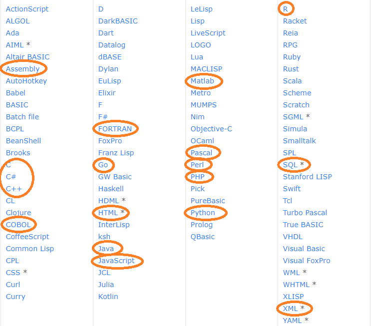
</center>

&nbsp;  
  
<center>
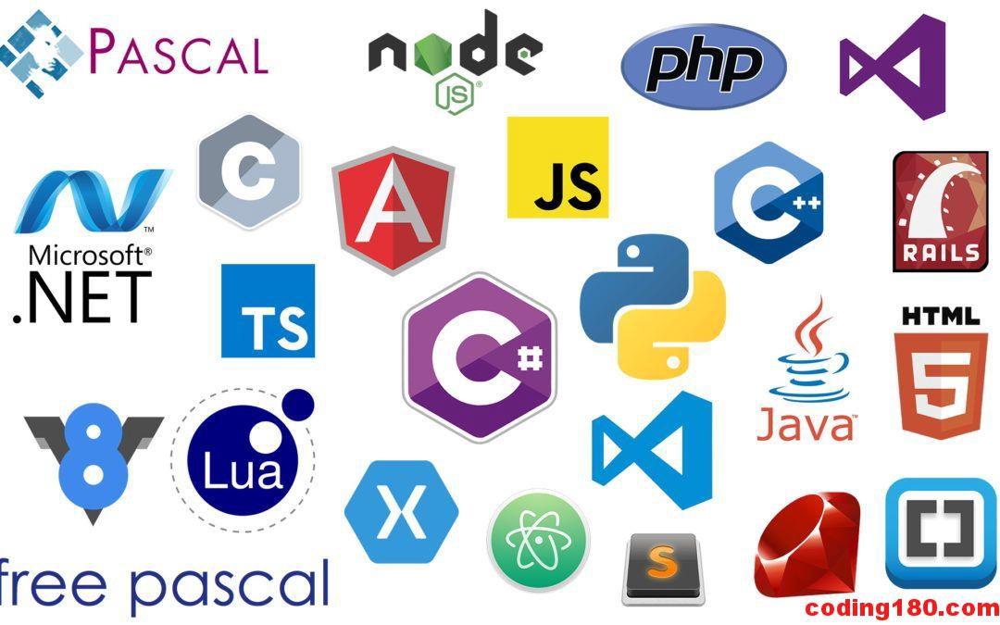{width=80%}
</center>

&nbsp;  

## Programming & Natural Language: Similarities and Differences

First of all, the main function of languages, be it a programming language 
or a natural language, is communication. This is the most important similarity 
between them, and one of the main reasons we refer to both of them as languages.  

Second, another important feature that they have in common is structure. 
I would like you to focus for a moment on the notion of formal language. 
A formal language consists of words whose letters are taken from an alphabet 
and are well-formed according to a specific set of rules. This is actually 
what we learned in primary school when we started to learn our country's 
natural language (or spoken language). Indeed, every natural language of the 
world is conceived exactly as a formal language, that is a combination of:  

 * an alphabet (with letters and symbols)  
 * a list of well-formed words
 * a set of rules, that is grammar, semantics and linguistic rules.  

When we talked about programming language, we saw that it is actually defined
as a formal language. The reason is that each programming language has its 
own words and combines them to create sentences and "novel" following specific 
grammar, syntax and semantic rules. In this regard, a programming language 
is very similar to a natural language.  

In particular, I like to think to programming in this way:  

 * objects (in oop languages) are nouns
 * functions are verbs
 * functions' arguments are adjectives  

The combination of these components in a *formal* way (that is following the 
specific rules of the programming language in use) creates a program (instead 
of a poems or a novel), which may be seen as a big function that performs some 
computer task. Moreover, in computer science, the practice combining words in 
sentences with the aim of writing computer programs is called **coding**, and 
code is written with a certain idea or intention in mind (semantics) while 
following the set of rules around the use of variables, functions, different 
kinds of parenthesis, colons, etc. (syntax). 
  
The main difference between a programming language and a natural language is 
that the former is created to communicate with machines, while the latter to 
humans. This is obvious, of course, but it means that what is written in a 
programming language is not free to interpretation. While in natural language 
context may exists many possible interpretations of single words and even more 
of sentences, in programming language this is not the case. A sentence, which 
is the combination of nouns (objects), verbs (functions) and adjectives 
(arguments), has just one possible meaning: which is what the code actually 
does. The lack of free interpretability may be seen as link to the mathematical 
definition of function: computer programs, written in a programming language, 
are actually functions that take some input (one or many), perform some task 
and return **AN** output.  
  
&nbsp;  
&nbsp;  
&nbsp;  
  


# R

&nbsp;  
  
<center>
{width=100%}
</center>

&nbsp;  


## What is the R Language?

&nbsp;  

According to the [TIOBE Index](https://www.tiobe.com/tiobe-index/), and 
many other programming language surveys, R is not among the most important 
programming languages. Why? and why is it so popular nonetheless?  
  
R is a free, open-source software and programming language developed in 1995 
at the University of Auckland as an environment for 
**statistical computing and graphics**. R is actually the evolution of the S 
programming language that was conceived in the Bell Laboratories around the 
'80~s~ and it was developed by Robert Gentleman & John Chambers. Since then 
R has become one of the dominant software environments for data analysis and 
is used by a variety of scientific disciplines, including social sciences, 
biology and bioinformatics, medicine, geoinformatics, finance and economics. 
R is particularly powerful for its graphical capabilities, its enormous amount 
of libraries regarding statistical modeling and it is also prized for its GIS
capabilities which make it relatively easy to generate raster-based models.  

R is an interpreted language, not a compiled one, meaning that all commands 
typed on the keyboard are directly executed without requiring to build a 
complete program like in most computer languages (C, FORTRAN, Pascal, ...). 
Moreover, R is also in the domain of Object-Oriented Programming (OOP) 
languages since it uses objects and method applied to them as fundamental units.  

All you need to know about R can be found on the 
[R-Project](https://www.r-project.org/) website. 

&nbsp;  
  
<center>
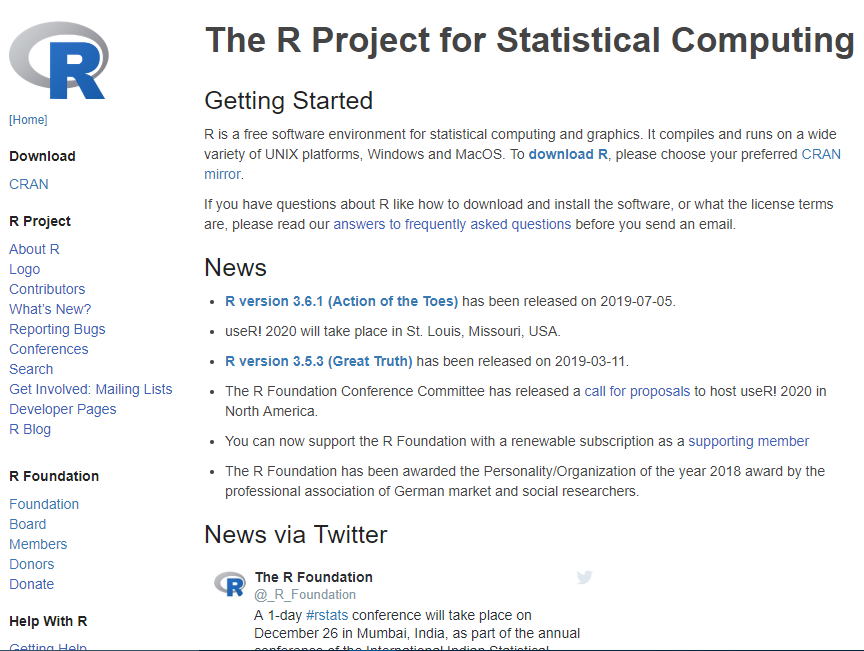{width=100%}
</center>

&nbsp;  


### Installing R

Installing R is very easy, all you need to do is to pick up the right 
solution based on your laptop's OS and configuration from the *R Project* 
website above or from the CRAN website below.    

&nbsp; 


### CRAN & Packages

On the [Comprehensive R Archive Network (CRAN)](https://cran.r-project.org/), 
instead, you can find all the R packages or libraries, coupled with their
documentation. Indeed, the CRAN is a network of ftp and web servers around 
the world that store identical, up-to-date, versions of code and documentation 
for R.  

&nbsp;  
  
<center>
{width=100%}
</center>

&nbsp;  
  
An R package (or library) is the fundamental unit of reproducible R code. 
It includes reusable R functions, the documentation that describes how to 
use them, and sample data.  

&nbsp;  


### Objects and Functions

The R world    
  
 * everything is an **object**  
 * everything that happen is a call to a function (**function call**)  
  
In R  

 * every object belongs to a **class**  
 * functions, whenever called, recognize the object's class and apply the 
 corresponding method (**dispatching**)  
 * the method performs ad hoc operations on the object and return an output  
 
When R is running, variables, data, functions, results, etc, are stored in
the active memory of the computer in the form of **objects** which have a name.
The user can do actions on these objects with **operators** (arithmetic, logical,
comparison, ...) and **functions** (which are themselves objects). 
All the actions of R are done on objects stored in the active memory of
the computer. 

Example

```{r}
my_object <- "Hello World" # here an object called my_object is created
print(my_object) # here the print function is called on the object my_object and the output is shown below
```

&nbsp;  


### R Environment

**Environment** can be thought of as a collection of objects (functions, 
variables etc.). An environment is created when we first fire up the R 
interpreter. Any variable we define, is now in this environment.

The job of an environment is to associate, or bind, a set of names to a 
set of values. You can think of an environment as a bag of names: each 
name points to an object stored elsewhere in memory; the objects don’t 
live in the environment so multiple names can point to the same object.  

&nbsp;  
  
<center>
{width=100%}
</center>

&nbsp;  


### R messages

Messages in R are displayed by functions call into the R Console and can be 
of three main types:  

 1. **errors** which stop the function because of some unexpected problem. 
 They need to be fixed in order to be able to proceed.    
 2. **warnings** are weaker than errors. They signal that something has 
 gone wrong, but the code has been able to recover and continue. Unlike errors, 
 you can have multiple warnings from a single function call.  
 3. **messages** are just informational.  
 
All these kind of messages are very important because they allow the user 
to understand if a function call is going well or not, and they help him 
to eventually recover problems.    

&nbsp;  
  
<center>
{width=100%}
</center>

&nbsp;  
  
  
## The R GUI

The **R GUI** (Graphical User Interface) is the simplest interface which 
comes with the installation of the R software.  

&nbsp;  
  
<center>
{width=100%}
</center>

&nbsp;  
  
  
## The RStudio IDE

&nbsp;  
  
<center>
{width=100%}
</center>

&nbsp;  
  
RStudio is an **integrated development environment** (IDE) that allows you 
to interact with R more readily. RStudio is similar to the standard R GUI, 
but is considerably more user friendly. It has more drop-down menus, windows 
with multiple tabs, and many customization options. The first time you open 
RStudio, you will see three windows. A forth window is hidden by default, 
but can be opened by clicking the File drop-down menu, then New File, and 
then R Script. Detailed information on using RStudio can be found at 
[RStudio’s Website](https://support.rstudio.com/hc/en-us/sections/200107586-Using-RStudio).  

&nbsp;  


### Installing RStudio

RStudio can be easily installed by downloading the correct file at 
[RStudio Download](https://www.rstudio.com/products/rstudio/download/#download).  

&nbsp;  


### Working with the RStudio IDE

RStudio remarkably ease working with R, since it allows the user to work 
through a variety of user friendly panes and tabs. Indeed, you can easily: 

 * write, modify and save R scripts  
 * interact with the code by means of the console  
 * constantly control the working environment  
 * navigate through files in your PC  
 * readily install R packages  
 * look at various types of graphs by the Plot tab  
 * look for help in the Help menu  

and many other options.  

&nbsp;  
  
<center>
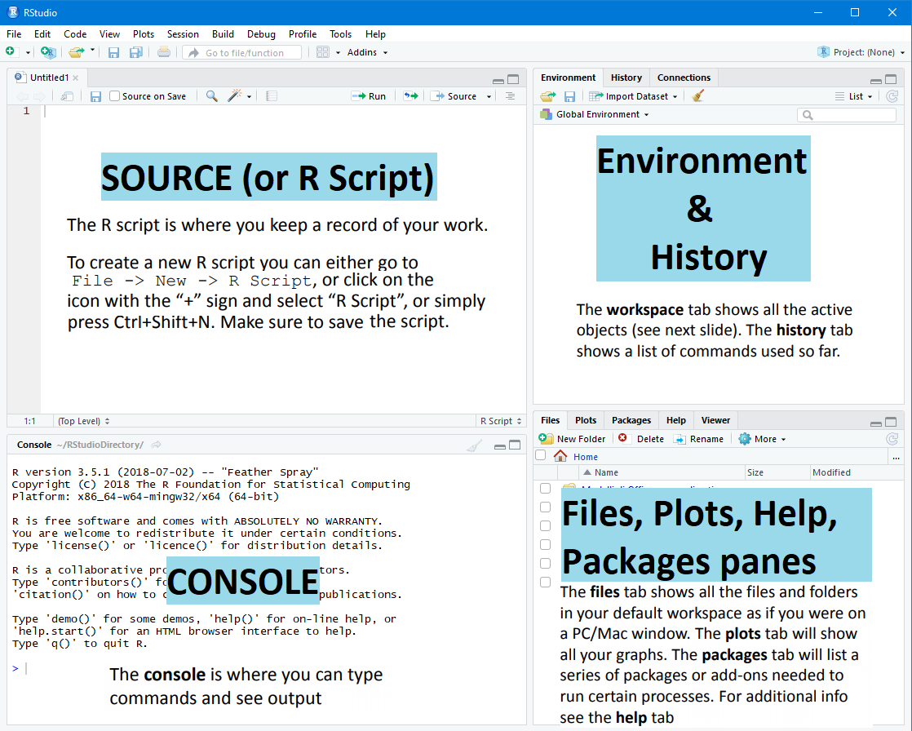{width=100%}
</center>

&nbsp;  
  
<center>
{width=100%}
</center>

&nbsp;  


### How to write R code: style guidelines

When writing code, it is very important to keep in mind that it should be 
easy to read. Hence, everyone should follow some very simple guidelines 
regarding the code style, that is:  

 * pick up a case and be consistent when naming object (use either 
 camelCase or snake_case);  
 * maximum 80 characters per line;  
 * use `<-` not `=` for assignment;  
 * separate functions and arguments by single space;  
 * add comments to scripts with `#`.  
  
To see more look at [Google guidelines](https://google.github.io/styleguide/Rguide.xml).  
  
&nbsp;    
&nbsp;    
&nbsp;    
  
  
  
# Basic R

&nbsp;  
  
<center>
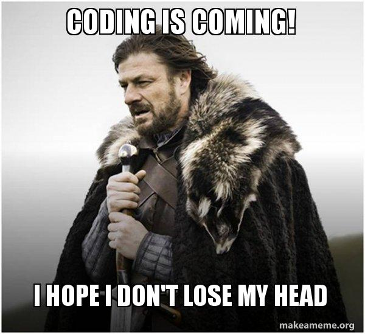{width=100%}
</center>

&nbsp;  
  
  
## Assignment Operator and Variables

We have seen that R works with objects which are, of course, characterized by
their names and their content, but also by attributes which specify the kind of
data represented by an object.  
However, how are objects created in R? Here comes the assignment operators.  
  
In R you can create an object (or a variable) by means of `<-` or `=` 
(leftward assignment) and `->` (rightward assignment).  
Essentially, the object creation is done as follows:  
  
```{r, eval=FALSE}
variable_name <- "content of the variable" # character
another_variable <- 2019 # numeric 
```

Usually the assignment is always on the left, meaning that on the left hand 
side there is the name of the variable (that will appear in the environment), 
while on the right hand side there is the value or content of the variable. 
The rightward assignments, although available, are rarely used.  

&nbsp;


## Some fundamental R commands

In the `base` R (which are the base functions that come with the R 
installation), there exist some fundamental commands (or functions) 
that everyone need to know before starting to program with R.  
Here are listed some of the most used:  
  
 * `getwd()` & `setwd()` gets or sets the working directory
 * `install.packages()` installs R packages  
 * `library()` load and attach R packages (so that you can use their functions)
 * `help()` or `?` brings up a help page
 * `ls()` lists all the R objects in your workspace     
 * `rm()` removes objects from the workspace  
 * `print()` prints the entire object (avoid with large tables)
 * `class()` extracts the class of an object
 * `:`, `seq()` & `rep()` allow to create sequences
 * `head()` (`tail()`) prints the first (last) 6 lines of your data   
 * `names()` lists the column names (i.e., headers) of your data   
 * `str()` shows the data structure of an R object  
 * `dim()` shows the dimension of your data  
 * `nrow()` & `ncol()` get number of rows and columns of an object  
 * `length()` extracts the length of an object  
 * `View()` send the output to the viewer pane  
 * `plot()` base graphic function of R
 
 
```{r, eval=FALSE}
# Run the following codes to see the output

getwd() # get the current working directory
setwd("your path") # set a specific working directory

install.packages("readxl") # install package readxl
library(readxl) # load package readxl

help("print") # get the documentation for the print function
?print

ls() # the environment is empty

# creating objects
x <- 1
y <- FALSE
z <- "Hello World"

ls() # the environment contains 3 variables 
rm(x) # removes x from the workspace
ls() # x is no more in the environment
rm(list = ls()) # clean all the workspace

print(iris) # prints iris objects
class(iris) # check class of iris object
typeof(iris) # check type of iris object
head(iris) # top 6 rows
tail(iris) # last 6 rows
str(iris) # structure of iris
dim(iris) # dimensions of iris
names(iris) # column names of iris
nrow(iris) # number of rows 
ncol(iris) # number of columns
length(iris) # get the length of the iris dataframe
View(iris) # send iris to the Viewer

plot(iris) # plot iris

1:10 # sequence from 1 to 10
seq(10) # same
seq(from = 1, to = 10, by = 0.5) # sequence from 1 to 10 by 0.5
sequence <- 1:10 # assign the sequence to an object named sequence
rep(1, 10) # repeates 1 ten times

```

&nbsp;  


## Arithmetic with R

Performing arithmetic operations in R is as easy as in simple calculators. 
The main difference is that you can perform arithmetic on objects.  
The fundamental arithmetic operators are:  

 * `+` addition  
 * `-` subtraction  
 * `*` multiplication  
 * `/` division  
 * `%/%` integer division  
 * `^` exponential  
 * `%%` modulus  

```{r, eval=FALSE}
# Run the following codes to see the output

# arithmetics
20 + 19
20 - 19
20 * 19
20 / 19
20 %/% 19
20 ^ 19
20 %% 19

# with objects
a <- 4
b <- 5

a + b
a - b
a * b
a / b
a %/% b
a ^ b
a %% b
```

&nbsp;  


## Data Types

In R there exists the following 5 main data types  

&nbsp;  
  
<center>
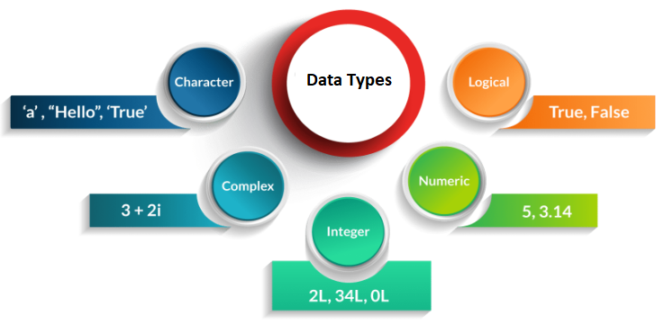{width=100%}
</center>

&nbsp;  
  
All numbers are numeric or double by default unless otherwise specified. 
Indeed, integer numbers are obtained adding an `L` after the last digit, 
while complex numbers are given by adding an `i`. Characters or strings 
are created surrounding a letter, a word or a sentence by single `'...'` 
or double `"..."` quotes. Logical instead may assume just two values, 
that is `TRUE` or `FALSE`.      

```{r, eval=FALSE}
# Run the following codes to see the output

# Numeric
class(2019)
a <- 2019
class(a)

# Integer
class(2019L)
a <- 2019L
class(a)

# Complex
class(2019i)
a <- 2019i
class(a)

# Character
class('Hello World')
a <- "Hello World"
class(a)

# Logical
class(TRUE)
class(FALSE)
a <- TRUE
class(a)

# note that in this example the object a is overwritten every time 

```

Finally, there are few special value types:    
  
 * `NA` is used to represent missing values. (`NA` stands for “not available.”) 
 You may encounter `NA` values in text loaded into R (to represent missing 
 values) or in data loaded from databases (to replace `NULL` values).  
 
 * `Inf` and `-Inf`, if a computation results in a number that is too big, R 
 will return `Inf` for a positive number and `-Inf` for a negative number 
 (meaning positive and negative infinity, respectively).  
 
 * `NaN`, sometimes a computation will produce a result that makes little 
 sense. In these cases, R will often return `NaN` (meaning “not a number”).  
 
 * `NULL`, additionally, there is a null object in R, represented by the 
 symbol `NULL`. (The symbol `NULL` always points to the same object.) `NULL` 
 is often used as an argument in functions to mean that no value was assigned 
 to the argument. Additionally, some functions may return `NULL`. Note that 
 `NULL` is not the same as `NA`, `Inf`, `-Inf`, or `NaN`.  
  
&nbsp;  
  
  
## Data Structures

&nbsp;  
  
<center>
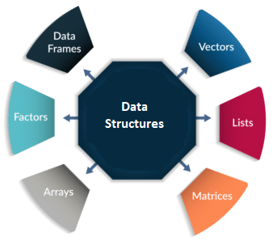{width=100%}
</center>

&nbsp;  

<center>
{width=100%}
</center>

&nbsp;   


### Vectors

**Vectors** are **one-dimension arrays** that can hold numeric data, character 
data, or logical data. In other words, a vector is a simple tool to store 
data of the **same type**.  
In R, you create a vector with the combine function `c()`. You place the vector 
elements separated by a comma between the parentheses. For example:  

```{r, eval=FALSE}
numeric_vector <- c(1, 2, 3)
character_vector <- c("a", "b", "c")
boolean_vector <- c(TRUE, FALSE, TRUE)
```

Empty vectors may also be created by means of the generic function `vector()`
specifying the mode of the vector you want to create.  

```{r, eval=FALSE}
numeric_empty_vector <- vector("numeric", 10)
character_empty_vector <- vector("character", 10)
```

An easy way to create numeric vectors is by creating sequences or repeating 
numbers.  

```{r, eval=FALSE}
numeric_vector <- 1:10
numeric_vector <- seq(from = 1, to = 20, by = 2)
numeric_vector <- rep(1, 10)
```

You may want to perform operations on vectors or with vectors, and also apply
functions on vectors, or combine vectors using `c()`.  

```{r, eval=FALSE}
x <- c(1, 2, 3)
y <- c(4, 5, 6)

x + y
x * y

mean(x) # mean of x
sd(y) # standard deviation of y

z <- c(x, y) # combine x and y into a new object z
```

&nbsp;  


### Factors

The term **factor** refers to a statistical data type used to store categorical 
variables. The difference between a **categorical** variable and a **continuous** 
variable is that a categorical variable can belong to a limited number of 
categories. A continuous variable, on the other hand, can correspond to an 
infinite number of values.  
It is important that R knows whether it is dealing with a continuous or a 
categorical variable, as the statistical models you will develop in the future 
treat both types differently.  
A good example of a categorical variable is gender. In many circumstances you 
can limit the sex categories to "Male" or "Female".  

To create factors in R, you make use of the function `factor()`. First thing 
that you have to do is create a vector that contains all the observations that 
belong to a limited number of categories. For example, sex_vector contains the 
sex of 5 different individuals:  

```{r, eval=FALSE}
sex_vector <- c("Male", "Female", "Female", "Male", "Male")
```

It is clear that there are two categories, or in R-terms **'factor levels'**, 
at work here: "Male" and "Female".  
The function `factor()` will encode the vector as a factor:    

```{r, eval=FALSE}
factor_sex_vector <- factor(sex_vector)
factor_sex_vector
```

Moreover, there are two types of categorical variables: a **nominal categorical** 
variable and an **ordinal categorical** variable.  
A nominal variable is a categorical variable **without an implied order**. This 
means that it is impossible to say that 'one is worth more than the other'.  
In contrast, ordinal variables do have a **natural ordering**. For instance the
temperature variable is an ordered factor and is created by specifying the 
argument `ordered = TRUE` and the levels.  

```{r, eval=FALSE}
temperature_vector <- c("High", "Low", "High", "Low", "Medium")
factor_temperature_vector <- factor(temperature_vector, ordered = TRUE, levels = c("Low", "Medium", "High"))
factor_temperature_vector
```

&nbsp;  


### Matrices

A **matrix** is a collection of elements of the **same data type** (numeric, 
character, or logical) arranged into a **fixed** number of rows and columns. 
Since you are only working with rows and columns, a matrix is called 
**two-dimensional**.  

You can construct a matrix in R with the `matrix()` function  

```{r, eval=FALSE}
matrix(data = NA, nrow = 1, ncol = 1, byrow = FALSE, dimnames = NULL)
```

The option **byrow** indicates whether the values given by data must fill
successively the columns (the default) or the rows (if `TRUE`). The option
**dimnames** allows to give names to the rows and columns.  
Here is an example of matrix creation  

```{r, eval=FALSE}
mat <- matrix(c(1:9), nrow = 3, ncol = 3)
mat

mat <- matrix(c(1:9), nrow = 3, ncol = 3, byrow = TRUE, 
              dimnames = list(c("row1", "row2", "row3"), c("col1", "col2", "col3")))
mat
```

&nbsp;  


### Data Frames

A **dataframe** is a table or a two-dimensional array-like structure in 
which each column contains values of one variable and each row contains 
one set of values from each column. It is not a matrix because in matrices 
all the elements have to be of the same type. In a dataframe, instead, you
can store different data types among different columns. Type consistency, however,
must be preserved within each column.  

In R one can create a dataframe with the `data.frame()` function  

```{r, eval=FALSE}
df <- data.frame(ID = c(1:5), 
                 Name = c("Rick","Dan","Michelle","Ryan","Gary"), 
                 Grade = c(18, 20, 23, 21, 29), 
                 stringsAsFactors = FALSE) # specify this argument to keep characters as is
df
```

One can apply some useful function to quickly explore a dataframe (or a matrix).  

```{r, eval=FALSE}
head(df, 2) # look the first 2 row of dataframe df
tail(df, 2) # look the last 2 row of dataframe df

str(df) # check the structure of dataframe df
names(df) # check columns' names
```

&nbsp;  


### Lists

Summarizing:  

 * **Vectors** (one dimensional array): can hold numeric, character or 
 logical values. The elements in a vector all have the same data type.  
 * **Matrices** (two dimensional array): can hold numeric, character or 
 logical values. The elements in a matrix all have the same data type.  
 * **Data frames** (two-dimensional objects): can hold numeric, character 
 or logical values. Within a column all elements have the same data type, 
 but different columns can be of different data type.  
 
A **list** object is just a container where you can put every object you
like, with no bindings on types and lengths.  
A list in R is similar to your to-do list at work or school: the different 
items on that list most likely differ in length, characteristic, and type 
of activity that has to be done. It allows you to gather a variety of objects 
under one name (that is, the name of the list) in an ordered way. These 
objects can be matrices, vectors, data frames, even other lists, etc. It is 
not even required that these objects are related to each other in any way. 
You could say that a list is some kind super data type: you can store 
practically any piece of information in it.  

To construct a list you use the function `list()`:  

```{r, eval=FALSE}
l <- list(comp1, comp2 ...)
```

The arguments to the list function are the list components. Remember, these 
components can be matrices, vectors, other lists, ...  

Following there are few examples:  

```{r, eval=FALSE}
l <- list(1, "a", TRUE, 1L) # unnamed list
l

l <- list(x = 1, y = "a", w = TRUE, z = 1L) # named list
l


my_vector <- 1:10 # vector with numerics from 1 up to 10
my_matrix <- matrix(1:9, ncol = 3) # matrix with numerics from 1 up to 9
my_df <- head(mtcars, 10) # first 10 elements of the built-in dataframe mtcars

my_list <- list(my_vector, my_matrix, my_df) # construct list with these different elements
my_list
```

&nbsp;  


### as.() and is.() family functions 

There exists some very useful functions that test whether an R object
is of a certain type or structure. These are the `is.()` function.   

```{r, eval=FALSE}
x <- c(0:5)

is.numeric(x)
is.character(x)
is.logical(x)

is.vector(x)
is.matrix(x)
is.factor(x)
is.data.frame(x)
is.list(x)
```

Furthermore, there is another important family of R functions that 
allow you to convert an object from one type or structure to another. 
These are the `as.()` functions.  

```{r, eval=FALSE}
x <- c(0:5)

as.numeric(x)
as.character(x)
as.logical(x)

as.vector(x)
as.matrix(x)
as.factor(x)
as.data.frame(x)
as.list(x)
```

and here are summarized some conversion rules  

&nbsp;  

<center>
{width=100%}
</center>

&nbsp;

Before going to the next section, it is important to know that 
there exists also a special function to check if a value is or 
not a missing value, that is the `is.na()` function.  

&nbsp;  


## Accessing values & Subsetting

It may happen you don't need to work with the entire objects 
you've just created, but only some parts or elements that objects
contain.  

In R one can access the values of an object by indexing or naming.  
The **indexing system** is an efficient and flexible way to access 
selectively the elements of an object; it can be either *numeric* or 
*logical* indexing.  

The most common way of extracting elements from an object (or 
sub-setting it) is to use the square bracket operator `[` according 
to the type structure of the object.  

For instance, one could do the following on vectors, matrices, 
dataframes and lists  

```{r, eval=FALSE}
# Run the following codes to see the output

help("[")


# Vectors
x <- 11:19  # creates a numeric vector whose elements are the values from 11 to 20
x

x[4] # extracts the fourth element
x[-4] # extracts all but the fourth element
x[2:4] # extracts elements from two to four
x[-(2:4)] # extracts all elements except from two to four
x[c(1, 5)] # extracts elements one and five


# Matrices
m <- matrix(x, 3, 3, byrow = TRUE)
m

m[2, ] # selects all row two
m[, 1] # selects all column one
m[2, 3] # selects the element on row two and column three (a23)
m[c(1, 3), c(1, 3)] # elements a11, a13, a31 and a33
m[, -2] # selects all except column two


# Lists
l <- list(x = 1:5, y = c('a', 'b'), z = c(TRUE, FALSE, FALSE))
l

l[1] # extracts the first element of l (a new list with only x)
l[[2]] # extracts the values of the second element of l (the character vector y)
l[[3]][1] # extracts the first value of the third element of l (the logical vector z)


# Dataframes 
df <- as.data.frame(m, stringsAsFactors = FALSE)
df

# df allow both matrix and list subsetting
df[, 2] # extracts the second column
df[1, ] # extracts the first row
df[2, 3] # extracts the element a23
df[2] # extracts the second column (with column name)
df[[3]] # extracts the elements of the third column

```

The second way of extracting values in R objects is by using the
**naming system**. The **names** are labels of the elements of 
an object, and thus of **mode character**. They are generally 
optional attributes. There are several kinds of names (names, 
colnames, rownames, dimnames).  

Hence you can easily access the elements of an objects by passing
its name attribute to the `[` operator or through the `$` operator.  

```{r, eval=FALSE}
# Run the following codes to see the output

help("[")
help("$")


# Vectors
x <- 11:19  # creates a numeric vector
names(x) # with no names
names(x) <- letters[1:length(x)] # assign names to the names of x
names(x)
x # now x is a named vector

x["a"] # extracts the element "a"
x[names(x)[3:5]] # extracts the elements with names in position 3, 4 and 5


# Matrices
m <- matrix(x, 3, 3, byrow = TRUE)
colnames(m)
colnames(m) <- c("X1", "X2", "X3") # assign names to columns
colnames(m)
rownames(m)
rownames(m) <- c("row1", "row2", "row3") # assign names to rows
rownames(m)
m

m["row3",] # extracts third row
m[, "X1"] # extracts first column


# Lists
l <- list(x = 1:5, y = c('a', 'b'), z = c(TRUE, FALSE, FALSE))
names(l) # the list is already named
l

l["y"] # extracts "y" object within the list l
l[["x"]] # extracts the values of x object within the list l 
l$x # same but with $ operator
l[["z"]][1] # extracts the first value of z object within the list l
l$z[1] # same but with $ operator


# Dataframes
df <- as.data.frame(m, stringsAsFactors = FALSE)
df
names(df)
colnames(df)
rownames(df)

# same as with lists
df["X1"]
df[["X2"]]
df$X3
```
  
Finally, another common thing that can be done by indexing or naming
is to replace values directly within an R object simply by using the 
well-known assignment operator `<-`.  

```{r, eval=FALSE}
# Run the following codes to see the output

x <- 11:19  # creates a numeric vector

x[4] <- 0 # replace the fourth element of x with value 0
x[6:8] <- 9999 # replace six to eigth elements of x with value 9999
x

# Replacement can be applied to any object be it a
# vector, matrix, dataframe or list.
```

&nbsp;    
&nbsp;    
&nbsp;    
  
  
  
# Intermediate R
  
&nbsp;  

<center>
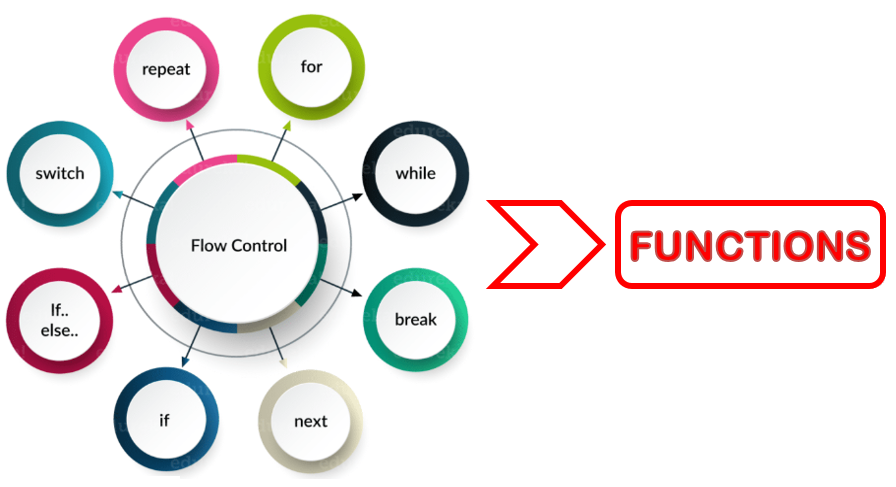{width=100%}
</center> 
  
&nbsp;    


## Relational Operators

Relational operators are used to compare between values. Here is a list of 
relational operators available in R:  

 * `<` less than  
 * `>` greater than  
 * `<=` less than or equal to  
 * `>=` greater than or equal to  
 * `==` equal to  
 * `!=` not equal to  
  
```{r, eval=FALSE}
# Run the following codes to see the output

# comparisons
a <- 5
b <- 16

a < b
a > b
a <= 5
b >= 20
b == 16
a != 5

# on vectors
x <- c(2, 8, 3)
y <- c(6, 4, 1)

x > y
```
  
&nbsp; 


## Logical Operators

Logical operators are used to carry out Boolean operations like AND, OR etc.  
  
 * `!` logical NOT (the opposite of)   
 * `&` element-wise logical AND  
 * `|` element-wise logical OR  
 * `&&` logical AND  
 * `||` logical OR  
  
Operators `&` and `|` perform element-wise operation producing result having 
length of the longer operand. Zero is considered `FALSE` and non-zero numbers 
are taken as `TRUE`. But `&&` and `||` examines only the first element of 
the operands resulting into a single length logical vector.    
  
```{r, eval=FALSE}
# Run the following codes to see the output

# logical operations
x <- c(TRUE, FALSE, 0, 1)
y <- c(FALSE, TRUE, FALSE, TRUE)

!x
x & y
x && y
x | y
x || y

```
  
&nbsp;  
  
```{r, eval=FALSE}
# combine all together
a <- 5
b <- 16
c <- 8
d <- 29

(a * b >= c) & (d %/% b == a)
# 80 >= 8    &     1 == 5
# TRUE       &     FALSE      = FALSE

(a * b >= c) | (d %/% b == a)
# 80 >= 8    |     1 == 5
# TRUE       |     FALSE      = TRUE

```
  
&nbsp; 


## Conditional subsetting

Value extraction and subsetting in R can be performed also by means of 
logical values.
Obviously R will keep only those values that are in the position of `TRUE`s, 
for instance  

```{r, eval=FALSE}
# Run the codes to see the output

x <- 11:15

x[c(TRUE, TRUE, FALSE, FALSE, TRUE)]


# It can be done also on matrices, dataframes and lists.
```
  
This implies that you can perform extractions and/or subsetting based on 
conditions using relational and logical operators. This is called 
**conditional subsetting**.  

Let's see some examples  

```{r, eval=FALSE}
# Run the codes to see the output

x <- 20:40

x[x == 10] # the elements of x whose value is equal to 10
x[x == 30] # the elements of x whose value is equal to 30
x[x < 35] # the elements of x whose values are less than 35
x[x == 22 | x >= 38] # the elements of x whose values are equal to 22 or greater and equal to 38
x[x != 20 & x != 30 & x != 40] # the elements of x whose values are not equal to 20, 30 and 40


# It can be done also on matrices, dataframes and lists.
```

In general, relational and logical operators returns either `TRUE` or `FALSE`. 
Sometimes however one could need the indices related to the elements that 
satisfy the condition tested. The R function that allows to do this is the 
`which()` function.  

```{r, eval=FALSE}
# Run the codes to see the output

x <- 20:40

x == 22 | x >= 38 # the condition returns TRUE or FALSE
which(x == 22 | x >= 38) # the which() function returns the indices 
x[which(x == 22 | x >= 38)] # then subsetting is as usual


# It can be done also on matrices, dataframes and lists.
```
  
&nbsp;  
  
  
## Conditional Statements

Conditional statements play a very important role in the Control Flow process 
as they allow you to perform actions based on conditions. For instance, if 
some condition is respected you may want your code to produce some output 
and something else otherwise. Every time this is the case, you end up using 
`if` or `if ... else` statements.  

 * `if` control statement: it evaluates a single condition. It is quite easy 
 as it just has a single keyword “if” followed by the condition and then 
 certain set of statements that needs to get executed in case it is true.  
 
&nbsp;  

<center>
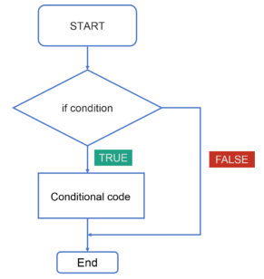{width=50%}
</center> 
  
&nbsp;
 
In this flowchart, the code will respond in the following way:  

 1. the condition is checked  
 2. if the condition is true, conditional code or the statements written will 
 be executed  
 3. if the condition is false, the statements gets ignored.  
 
In R the `if` control statement has the following syntax  
 
```{r, eval=FALSE}
if (condition) {
    Statement 1 # perform some actions if condition is met
}
```
 
and here is an example  
 
```{r, eval=FALSE}
# Run the following codes to see the output

# Check if a number is even:

number <- 10

# 1) if the modulo is 0 then it is even
number %% 2  

# 2) we need to create a condition that returns to TRUE or FALSE
(number %% 2) == 0 # this is our condition
is_even <- (number %% 2) == 0

# 3) create the if control statement
if (is_even) {
  print("Even") # this is the statement which prints "Even" only if the condition is met
}


# Try to change the value of the number object and see what happens.
# In the case of odd numbers the print function is not executed!

```
 
&nbsp;  

 * `if else` control statement: it evaluates a group of conditions and 
 selects the statements.
 
&nbsp;  

<center>
{width=100%}
</center>

&nbsp;  
 
 In this flowcharts, the code will respond in the following way:  
 
 1. the first `if` condition is checked  
 2. if the condition is true, the first 'if' statement will get executed  
 3. if the condition is false, then it goes to the `else if` condition and 
 if it is true, the 'else if' code will be executed (right flowchart)   
 4. finally, if the 'else if' code is also false, then it will go to `else` 
 code and it gets executed. This means if none of these conditions are true, 
 then the 'else' statement gets executed.  

In R the `if else` control statement has the following syntax  
 
```{r, eval=FALSE}
if (condition) {
  Statement 1 # perform some actions if condition is met
} else {
  Statement 2 # perform other actions if condition is not met
}


if (condition1) {
  Statement 1 # perform some actions if condition 1 is met
} else if (condition2) {
  Statement 2 # perform some other actions if condition 1 is not met but condition 2 does
} else {
  Statement 3 # perform some actions if none of the conditions is met
}


# You can expand to as many condition and statements you need.

```

and here are few examples    
 
```{r, eval=FALSE}
# Run the following codes to see the output

# Check if a number is even or odd

number <- 11

# 1) if the modulo is 0 then it is even
number %% 2  

# 2) we need to create a condition that returns to TRUE or FALSE
(number %% 2) == 0 # this is our condition
is_even <- (number %% 2) == 0

# 3) create the if else control statement
if (is_even) {
  print("Even") # this is the statement which prints "Even" only if the condition is met
} else {
  print("Odd") # this is the statement which prints "Odd" when the condition is not met
}


# Try to change the value of the number object and see what happens.
# In the case of odd numbers the second print function is executed!

```
 
&nbsp;  

```{r, eval=FALSE}
# Run the following codes to see the output

# Check if a number is either divisible by 3 or 5 or none

number <- 12

# create the if else control statement
if ((number %% 5) == 0) {
  print("Divisible by 5") 
} else if ((number %% 3) == 0) {
  print("Divisible by 3")
} else {
  print("None")
}


# Try to change the value of the number object and see what happens.
# Oops! Try to set the value of number to 15. What's missing? Try to fix the problem by yourself, then check the solutions.

```

It is also useful to know that there exists the `ifelse()` function which 
acts exactly as the "IF" function of MS Excel. This is defined as  

```{r, eval=FALSE}
ifelse(test, yes, no)
```

the first argument being the condition, the second is the output if the 
condition is TRUE while the third is the value if the condition is FALSE.  
  
Now try to solve the following exercises.  

### {- .tabset .tabset-fade .tabset-pills .toc-ignore}

#### Happy Birthday {-}

Write a simple control statement that prints "Happy Birthday!" if its your birth date.  
Hint: make use of the function `Sys.Date()` in the condition to extract today's date.  

#### Solution {-}

```{r, eval=FALSE}
birth_date <- "yyyy-mm-dd" # write here your birth date

if (birth_date == Sys.Date()) {
  print("Happy Birthday!")
} else {
  print("Today is not your birthday.")
}
```

#### How much did you sell 1? {-}

Examine whether a variable stored as "quantity" is above 20. If quantity is 
greater than 20, the code will print "You sold a lot!" otherwise Not enough 
for today.  

#### Solution {-}

```{r, eval=FALSE}
quantity <-  25

if (quantity > 20) {
    print("You sold a lot!")
} else {
    print("Not enough for today")  
}
```

#### How much did you sell 2? {-}

We are interested to know if we sold quantities between 20 and 30. If we do, 
then the pint "Average day". If quantity is greater than 30 we print 
"What a great day!", otherwise "Not enough for today".  

#### Solution {-}

```{r, eval=FALSE}
quantity <-  10

if (quantity < 20) {
  print("Not enough for today.")
} else if (quantity > 20  & quantity <= 30) {
  print("Average day.")
} else {
  print("What a great day!")
}
```

#### Divisible by 5 & 3 {-}

Check by means of a control statement if a number is divisible by 5, 3, 
both or none.  
Hint: make use of the `&` logical operator if you don't like math.

#### Solution {-}

```{r, eval=FALSE}
number <- 15

# if you don't like math
if ((number %% 5) == 0 & (number %% 3) == 0) {
  print("Divisible by 5 and 3")
} else if ((number %% 5) == 0) {
  print("Divisible by 5") 
} else if ((number %% 3) == 0) {
  print("Divisible by 3")
} else {
  print("None")
}

# if you like math
if ((number %% 15) == 0) {
  print("Divisible by 5 and 3")
} else if ((number %% 5) == 0) {
  print("Divisible by 5") 
} else if ((number %% 3) == 0) {
  print("Divisible by 3")
} else {
  print("None")
}
```

#### Take Control! {-}

In this exercise, you will combine everything that you've learned so far: 
relational operators, logical operators and control constructs. 
You'll need it all!  

Code two values beforehand: `li` and `fb`, denoting the number of profile 
views your LinkedIn and Facebook profile had on the last day of recordings. 
Go through the instructions to create R code that generates a 
"social media score", `sms`, based on the values of `li` and `fb`.  

Create the control-flow construct with the following behavior:  

 * initialize the li and fb variable to 9 and 15.  
 * if both li and fb are 15 or higher, set sms equal to double the sum of li and fb.  
 * if both li and fb are strictly below 10, set sms equal to half the sum of li and fb.  
 * in all other cases, set sms equal to li + fb.  
 * finally, print the resulting sms variable to the console.  

#### Solution {-}

```{r, eval=FALSE}
# Variables related to your last day of recordings
li <- 15
fb <- 9

# Code the control-flow construct
if (li >= 15 & fb >= 15) {
  sms <- 2 * (li + fb)
} else if (li < 10 & fb < 10) {
  sms <- 0.5 * (li + fb)
} else {
  sms <- li + fb
}

# Print the resulting sms to the console
sms
```
  
&nbsp;  

  
## Looping Together

In the Control Flow process, Loops help you to repeat certain set of actions 
so that you don’t have to perform them repeatedly. Imagine you need to perform 
an operation 10 times, if you start writing the code for each time, the length 
of the program increases and it would be difficult for you to understand it 
later. But at the same time by using a loop, if I write the same statement 
inside a loop, it saves time and makes easier for code readability. It also 
gets more optimized with respect to code efficiency. 

&nbsp;  

<center>
{width=100%}
</center>

&nbsp;

In the above image, `repeat` and `while` loops help you to execute a certain 
set of rules until the condition is true. A `for` instead is a loop that is
used when you know how many times you want to repeat a block of statements. 
Now, if you know that you want to repeat it for 10 times, then you go with 
`for` loop but if you are not sure about how many times you want the code to 
be repeated, you will go with `repeat` or `while` loop.  

 * `repeat` loop: helps to execute the same set of code again and again until 
 a stop condition is met.  
 
&nbsp;  

<center>
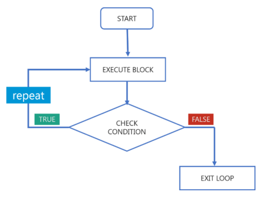{width=50%}
</center>

&nbsp;

In the above flowchart, the code will respond in the following steps:  

 1. first it will enter and execute a set of code  
 2. next it will check the condition, if it is true it will go back and 
 execute the same set of code again until it is meant to be false  
 3. if it is found to be false, it will directly exit the loop.  
 
In R the `repeat` loop statement has the following syntax 

```{r, eval=FALSE}
repeat {
  statement # executes some code
  if (condition) { # check the condition
    break # if the condition is met, exit the loop with break
  }
}
```

and here is an example

```{r, eval=FALSE}
# Run the following codes to see the output

x <- 1 # initialize a variable

repeat {
  print(x) # execute some code
  x <- x + 1 # increment the variable
  if (x == 6) { # check the condition
    break # if TRUE exit the loop
  }
}
```
  
&nbsp;  
   
 * `While` loop: helps to execute the same set of code again and again until 
 a stop condition is met.
 
&nbsp;  

<center>
{width=50%}
</center>

&nbsp;

In the above flowchart, the code will respond in the following steps:

 1. first it will check the condition  
 2. if it is found to be true, it will execute the set of code  
 3. next, it again checks the condition, if its true it will execute the same 
 code again. As soon as the condition is found to be false, it immediately 
 exits the loop.  

In R the `while` loop statement has the following sintax 

```{r, eval=FALSE}
while (condition) { # check the condition
  statement # if TRUE executes code otherwise exit the loop
}
```

and here is an example

```{r, eval=FALSE}
# Run the following codes to see the output

x <- 2 # initialize a variable

while (x < 1000) { # check the condition
  x <- x^2 # if TRUE do something: square the variable
  print(x) # and print its value
}
```
  
&nbsp;  
   
 * `for` loop: is used when you need to execute a block of code several number 
 of times (you must know how many times).  
   
&nbsp;  

<center>
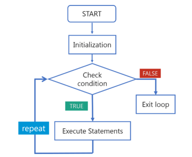{width=50%}
</center>

&nbsp;

In the above flowchart, the code will respond in the following steps:  

 1. first of all there is initialization where you specify how many times you 
 want the loop to repeat  
 2. next it will execute the set of code for the specified number of times.    
 
In R the `for` loop statement has the following syntax 

```{r, eval=FALSE}
for (i in vector) {
    statements
}
```

and here is an example

```{r, eval=FALSE}
# Run the following codes to see the output

# Type 1
for (i in 1:10) {
 print(paste("User", i))
}

# Type 2
x <- c(2, 4, 6, 8, 10)
for (i in x) {
 print(paste("User", i))
}

# Type 3
x <- c("User 1", "User 2", "User 3", "User 4", "User 5")
for (i in 1:length(x)) {
  print(x[i])
}

```
  
Now try to solve the following exercises.  

### {- .tabset .tabset-fade .tabset-pills .toc-ignore}

#### Fill objects with loops {-}

Creates a non-linear function by using the polynomial of x between 1 and 6 
and store it in a list.  

#### Solution {-}

```{r, eval=FALSE}
# Create an empty list
l <- list()

# Create a for statement to populate the list
for (i in seq(1, 6, by = 1)) {
  list[[i]] <- i * i
}

print(list)
```

#### Loop over a list {-}

Looping over a list is just as easy and convenient as looping over a vector. 
Create a list containing few elements and try to extract its element 
sequentially.    

#### Solution {-}

```{r, eval=FALSE}
# Create a list with three vectors
fruit <- list(Basket = c('Apple', 'Orange', 'Passion fruit', 'Banana'), 
              Money = c(10, 12, 15), 
              purchase = FALSE)

for (p in fruit) { 
	print(p)
}
```

#### Loop over a matrix {-}

A matrix has 2-dimension, rows and columns. To iterate over a matrix, 
we have to define two for loop, namely one for the rows and another for 
the column. Create a matrix and use for loops to extract every value 
sequentially.  

#### Solution {-}

```{r, eval=FALSE}
# Create a matrix
mat <- matrix(data = seq(11, 22, by = 1), nrow = 6, ncol = 2)
mat

# Create the loop with r and c to iterate over the matrix
for (r in 1:nrow(mat)) {
  for (c in 1:ncol(mat)) {
    print(paste("Row", r, "and column", c, "have values of", mat[r, c]))
  }       
}

```

#### Combine all together: The "Bizz-Buzz" Game {-}

Create a numeric vector of length 100 and fill it with numbers from 1 to 
100. Loops on this vector and print the numbers it contains except that:  

 * print "Bizz" instead of numbers divisible by 3;  
 * print "Buzz" instead of numbers divisible by 5;  
 * print "Bizz-Buzz" instead of numbers divisible by 15.  

#### Solution {-}

```{r, eval=FALSE}
x <- 1:100

for (i in x) {
  
  if (i %% 15 == 0) {
    print("Bizz-Buzz")
  } else if (i %% 5 == 0) {
    print("Buzz") 
  } else if (i %% 3 == 0) {
    print("Bizz")
  } else {
    print(i)
  }
  
}
```
  
&nbsp;  
  
&nbsp; 


## The map() functions

A very powerful tool of some programming languages (not all) and of R is 
the so called Functional Programming. The idea of passing a function to 
another function is extremely powerful idea, and it’s one of the behaviors 
that makes R a functional programming language.   
Here, we'll focus on the `purrr` package and the `map()` function which 
eliminates the need for many common for loops.  
The **apply** family of functions in base R (`apply()`, `lapply()`, `tapply()`, 
etc) solve a similar problem, but `purrr` is more consistent and easier to 
learn.  

```{r, eval=FALSE}
install.packages("purrr")
library(purrr)
help("map")
```

The simplest `map()` function allows essentially to apply a function over 
vectors, lists, dataframes and matrices. It transforms its input by applying 
a function to each element and returning a vector (or list) the same length 
as the input. 
Here are few examples  

```{r, eval=FALSE}
# Map over list
l <- list(a = rnorm(100, 0, 1),
          b = rnorm(100, 20, 1), 
          c = rnorm(100, -10, 2))
map(l, mean) # apply the function mean to all the element of list l
map(l, median) # apply the function median to all the element of list l
map(l, sd) # apply the function standard deviation to all the element of list l

# Map over dataframe
df <- as.data.frame(l) # transform l to a dataframe
map(df, mean) # apply the function mean to all columns of dataframe df
map(df, median) # apply the function median to all columns of dataframe df
map(df, sd) # apply the function standard deviation to all columns of dataframe df

# Map over matrix
mat <- as.matrix(df)
map(mat, mean) # apply the function mean to all columns of matrix mat
map(mat, median) # apply the function median to all columns of matrix mat
map(mat, sd) # apply the function standard deviation to all columns of matrix mat
```
  
&nbsp;    
&nbsp;    
  
  
## Functions

Most of R’s work is done with functions which arguments are given within
parentheses. Users can write their own functions, and these will have exactly 
the same properties than other functions in R. Writing your own functions 
allows an efficient, flexible, and rational use of R.  

&nbsp;  


### Define a function

As in other programming language, in R the concept of function is directly 
built on that of mathematical functions, that is 
*"a relation between some inputs and an output"*.  
In the context of computer programming we can state this principle as the 
**black-box rule**.   

&nbsp;  

<center>
{width=100%}
</center>

&nbsp;

Hence, we can imagine functions as black-box taking inputs and giving 
back an output. 
They essentially transforms inputs into an output.  

In R a function is defined in the following way  

```{r, eval=FALSE}
# Function of one variable
my_fun <- function(input) {    # the function takes an input (or argument)
  body                         # the body is code to be executed when the function is called 
  return(output)               # the function return an output using the return function
}

# Function of more than one variable
my_fun <- function(input1, input2) {
  body
  return(output)
}
```

Notice that this recipe uses the assignment operator (`<-`) just as if you were 
assigning a vector to a variable for example. This is not a coincidence. Creating 
a function in R basically is the **assignment of a function object to a variable**! 
In the recipe above, you're creating a new R variable `my_fun`, that becomes 
available in the workspace as soon as you execute the definition. 
From now on, you can use the `my_fun` as a function.  

The second important rule regarding R functions is related to how arguments 
are matched. 
**Argument matching** in R may be summarized in the following way:    

Consider for example the function `mean()`, which computes the standard mean 
of a vector of numbers

&nbsp;  

<center>
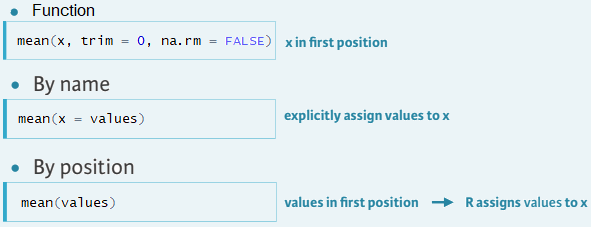{width=75%}
</center>

&nbsp;

arguments may be matched **by name**, meaning that you explicit write the 
name of the 
arguments you want to use and assign them their values, or **by position**, 
you just impute the values in the order of the arguments and let R assigning 
them. You can check the arguments of a function through the `help()` or 
the `args()` commands.  

Finally, the third fundamental rule of R function is that 
**arguments may have default values**.  

Now it's time to create your own functions!  

&nbsp;  

### Create functions

Try to solve the following exercises that teach you how to build functions in R
and compare your results with the proposed solutions.  
Remember: most of the time, there is no unique way to code something but the 
results must be the same.  

### {- .tabset .tabset-fade .tabset-pills .toc-ignore}

#### Fun Hello World {-}

Create a function that prints to the console a character string you want and use 
it with "Hello World, this is my first function!"    

#### Solution {-}

```{r, eval=FALSE}
new_print <- function(string) {
  return(print(string)) # with return
}

# or
new_print <- function(string) {
  print(string) # without return
}


new_print("Hello World, this is my first function!")

# Try it with numbers!

# As you saw, this is simply not necessary at all since you just need to call 
# the print() function to do this.
```

#### Fun Hello World 2 {-}

Now create a new version of the previous function. This time it should take two 
arguments and combine them together in a single string to be printed out.  
Hint: make use of the function `paste()`.  

#### Solution {-}

```{r, eval=FALSE}
new_print2 <- function(string1, string2) {
  string_complete <- paste(string1, string2)
  return(print(string_complete)) # with return
}

new_print2("Hello World", "this is my second function!")
```

#### Square Root {-}

Create a function that performs the square root of a number. 
Hint: the square root is just an fractional exponential.  

#### Solution {-}

```{r, eval=FALSE}
new_sqrt <- function(x) {
  x_square_root <- x ^ (1/2)
  return(x_square_root)
}

sqrt(4)
new_sqrt(4)

# Try it on vector
sqrt(c(4, 9, 16))
new_sqrt(c(4, 9, 16))

# it works perfectly since the ^ (exp) operator in R is vectorised!
```

#### (E)very Power {-}

Now modify the previous function to be able to apply any kind of power you 
want, with default to 2.  
Hint: this new function should have two arguments.  

#### Solution {-}

```{r, eval=FALSE}
power <- function(x, exp = 2) {
  x_power <- x ^ exp
  return(x_power)
}

power(4) # if you call it without specifying the argument exp it apply the square
power(4, 1/2) 
power(3, 3)
power(27, 1/3)
```

#### Is 2020 a leap year? {-}

In this exercise you have to combine many topics that you have learnt so far.  
Follow the instruction to create a function that tests if an year is or not 
a leap year.  

 * if a year is divisible by 4, 100 and 400, it's a leap year;  
 * if a year is divisible by 4 and 100 but not divisible by 400, it's not a 
 leap year;  
 * if a year is divisible by 4 but not divisible by 100, it's a leap year;  
 * if a year is not divisible by 4, it's not a leap year.  

Moreover, control that the year passed to the function is numeric with 
`is.numeric()`. 
In the case it doesn't exit the function printing an error message by means 
of the `stop()` function.  

#### Solution {-}

```{r, eval=FALSE}
leap_year <- function(year) {
  
  if (!is.numeric(year)) { # is.numeric returns TRUE if it numeric, FALSE otherwise, hence use ! to negate
    stop("The year argument must be numeric!") # stop the execution
  }
  
  if ((year %% 4) == 0) {
    
    if ((year %% 100) == 0) {
      
      if ((year %% 400) == 0) {
        
        print(paste(year, "is a leap year.")) # divisible by 4, 100 and 400
      
      } else { print(paste(year, "is not a leap year.")) } # divisible by 4 and 100 but not by 400
      
    } else { print(paste(year, "is a leap year.")) } # divisible by 4 but not by 100
    
  } else { print(paste(year, "is not a leap year.")) } # not divisible by 4
  
} # close the function

leap_year(2020)
leap_year("2020")
```
  
&nbsp;    
&nbsp;    
&nbsp;    
  
  
  
# Extra Topics

## Tidy Data

It is often said that 80% of data analysis is spent on the cleaning and 
preparing data. To get a handle on the problem, there are some aspects of 
data cleaning that are called **data tidying**: structuring datasets to 
facilitate analysis.  
The principles of tidy data provide a standard way to organize data values 
within a dataset. A **dataset** is a collection of values, usually either 
numbers (if quantitative) or strings (if qualitative). **Values** are 
organised in two ways. Every value belongs to a variable and an observation. 
A **variable** contains all values that measure the same underlying attribute 
(like height, temperature, duration) across units. An **observation** contains 
all values measured on the same unit (like a person, or a day, or a race) 
across attributes.  

**Tidy data** is a standard way of mapping the meaning of a dataset to 
its structure. A dataset is messy or tidy depending on how rows, columns 
and tables are matched up with observations, variables and types. In tidy data:  

 1. Each variable forms a column.  
 2. Each observation forms a row.  
 3. Each type of observational unit forms a table.  

Most of these concepts are taken from Hadley Wickham's 
[Tidy Data](https://vita.had.co.nz/papers/tidy-data.html) paper.
  
&nbsp;    
  
  
## Importing Data with R

Nowadays data can be stored everywhere: on databases, on cloud storage 
containers, on web pages and also on local files. Nonetheless one of the 
most common ways of storing data is on csv (comma separated value) or 
xlsx (Excel) files. Hence, it is fundamental to be able to import data in R 
from those messy format.  

In R there exist many packages that include functions to work with data 
stored in different file formats. The `readr` and `readxl` package belongs 
to the Tidyverse and are very useful libraries to import data from csv, the 
former, and xlsx, the latter.  

This packages include the functions read_csv() and read_excel() that allow 
exactly to import data in R in a common R structure (usually a dataframe, 
possibly a tidy one).  

```{r, eval=FALSE}
install.packages(c("readr", "readxl"))
library(readr)
library(readxl)

read_csv(file)
read_excel(path, sheet)
```

RStudio allows also to import data in a more user friendly and less 
programmatic way. Indeed, you can navigate through the **File** pane on 
bottom right until you reach the csv or Excel file, click on the file name 
and select "Import Dataset".  
  
&nbsp;    
  
  
## Statistics

"Statistics are like bikinis. What they reveal is suggestive, but what they 
conceal is vital." *Aaron Levenstein*  

"Statistics is a branch of mathematics working with data collection, 
organization, analysis, interpretation and presentation." 
[Wikipedia](https://en.wikipedia.org/wiki/Statistics) 
It is the science of data, and uses probability to make conclusions regarding 
reality.  

There are two main branches of statistics:  

 * **descriptive statistics** which is only concerned with properties of the 
 observed data, that is it is just the analysis of the data at hand.  
 * **inferential statistics** which uses data analysis to deduce properties
 of a population and build general models.  
 
As already said, R is a statistical programming language and it means that 
it can be used to do as many statistical analysis as you can imagine. 
Almost every model and statistical technique is implemented in R, which 
means that there exists at least one R package doing the analysis you
are looking for.    

The aim of this section is just to give a very brief introduction on some 
basic tools of descriptive statistics and a light presentation of the 
most known inferential method, the linear regression model, with R.   

If you want more details on these topics you can use the following free 
online material  

[Quick-R](https://www.statmethods.net/stats/index.html),
[R-Tutorial](http://www.r-tutor.com/elementary-statistics).  
  
&nbsp;    
  
  
### Descriptive Statistics

```{r, eval=FALSE}
# Run the following codes to see the output

# Create a population (uniformly distributed)
p <- rep(-5:5, 100000) # population


# Univariate Case
set.seed(2507)
x <- sample(p, 1000) # sample 1

min(x)
max(x)

mean(x) # mean
var(x) # variance
sd(x) # standard deviation

table(x) # absolute frequencies
prop.table(table(x))*100 # relative frequencies

median(x) # median
quantile(x, probs = c(0.25, 0.5, 0.75)) # quartiles

summary(x) # some descriptive statistics
Hmisc::describe(x)

hist(x)
boxplot(x)


# Bivariate Case
set.seed(2607)
y <- sample(p, 1000) # sample 2

summary(y)

cov(x, y, method = "pearson") # low covariance
cor(x, y, method = "pearson") # zero correlation

cor(sort(x), sort(y), method = "pearson") # perfect positive correlation
cor(sort(x, decreasing = TRUE), sort(y), method = "pearson") # perfect negative correlation

library(PerformanceAnalytics)
chart.Correlation(cbind(x, y), histogram = TRUE, pch = 19)
chart.Correlation(cbind(sort(x), sort(y)), histogram = TRUE, pch = 19)
chart.Correlation(cbind(sort(x, decreasing = TRUE), sort(y)), histogram = TRUE, pch = 19)

my_data <- mtcars[, c(1, 3, 4, 5, 6, 7)]
chart.Correlation(my_data, histogram = TRUE, pch = 19)
```
  
&nbsp;    
  
  
### Inference: the Linear Regression model

"All models are wrong, but some are useful." *George E. P. Box*

```{r, eval=FALSE}
data(marketing, package = "datarium")

summary(marketing)
table(marketing == 0)
marketing <- marketing + 0.01 # to avoid logaritmic problems

chart.Correlation(marketing, histogram = TRUE, pch = 19)

# Estimate a multiple linear regression model
mod <- lm(sales ~ youtube + facebook + newspaper, data = marketing) 
summary(mod)


marketing <- round(log1p(marketing), 2) # transform variables to log scale
names(marketing) <- paste0("log_", names(marketing)) # change names

# Estimate a multiple log-linear regression model
mod_log <- lm(log_sales ~ log_youtube + log_facebook + log_newspaper, data = marketing) 
summary(mod_log)
```
  
&nbsp;    
&nbsp;  
  
  
## JOINS in R

There exists at least five possible 
[joining operations](https://en.wikipedia.org/wiki/Join_(SQL)) 
that you can do when working with data:  

 * left join  
 * right join  
 * inner join  
 * anti join  
 * full join  

&nbsp;  

<center>
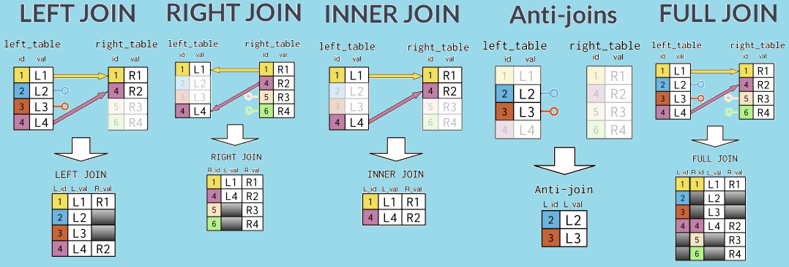{width=100%}
</center>

&nbsp;

These can be easily performed in R by means of the base `merge` function.
Otherwise, the package `dplyr` from the Tidyverse contains the very same 
SQL functions: `left_join()`, `right_join()`, etc.  

&nbsp;    
&nbsp;    
&nbsp;    


# Conclusions

Don't be scared, R does not eat humans and remember:  
  
Google is always your best friend, but...  

[42](https://www.youtube.com/watch?v=aboZctrHfK8)  

questions need to be well defined otherwise the answer will be 42!  
  
&nbsp;    
